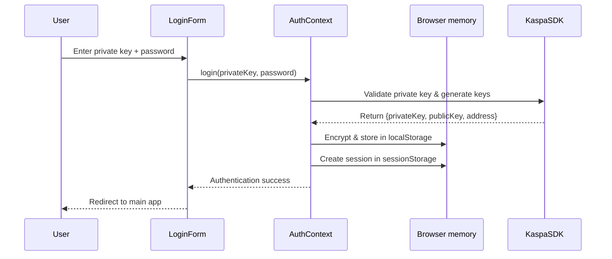
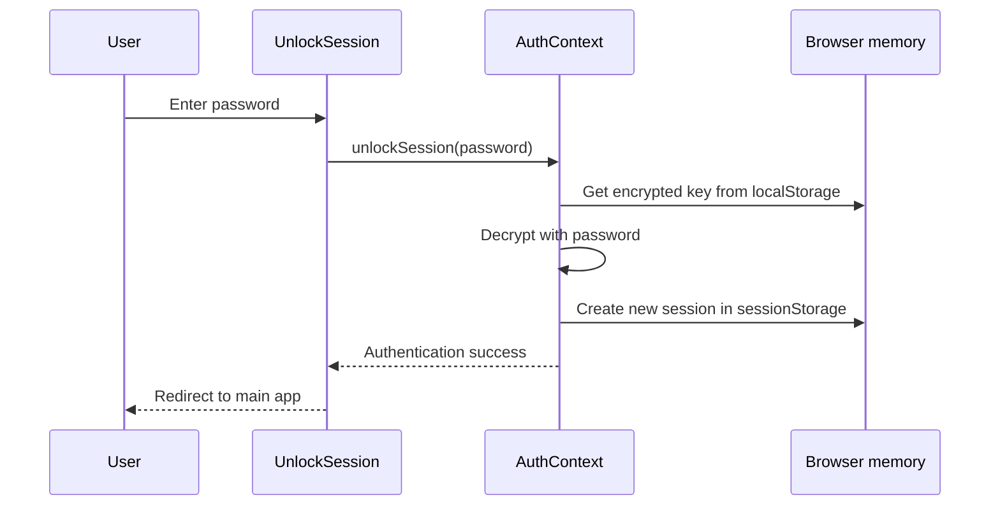
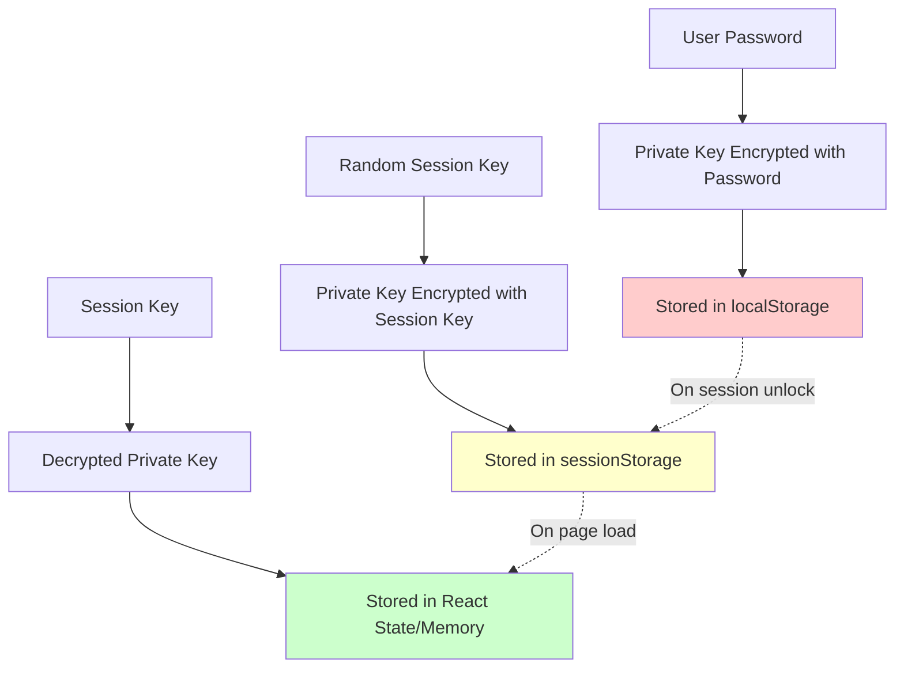
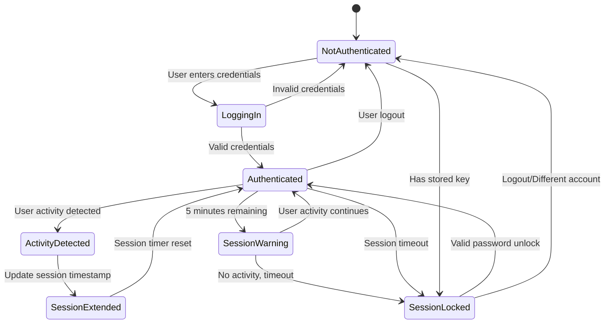
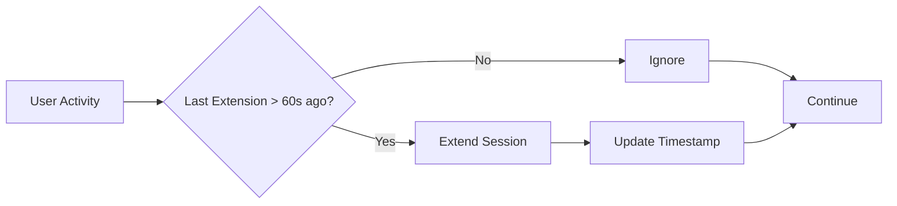
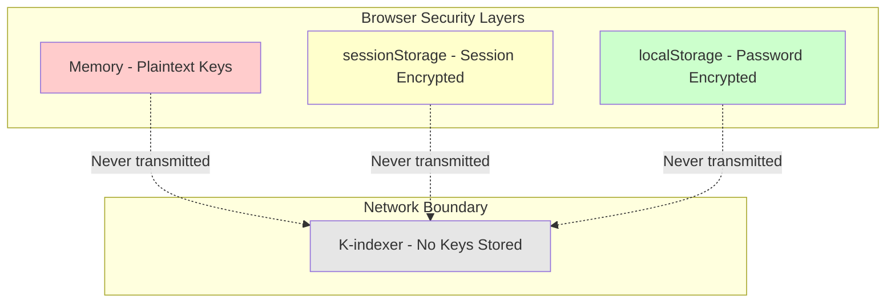
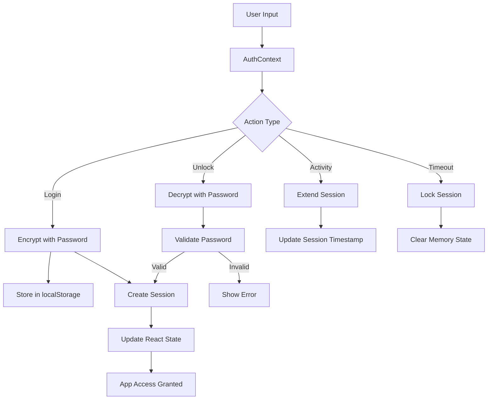

# Authentication & Private Key Management Documentation

## Overview

This document describes how the webapp handles user authentication, private key storage, session management, and security. The system is designed to provide secure handling of cryptographic keys while maintaining user convenience through persistent sessions.

## Table of Contents
1. [Authentication Flow](#authentication-flow)
2. [Private Key Storage](#private-key-storage)
3. [Session Management](#session-management)
4. [Security Layers](#security-layers)
5. [User Experience](#user-experience)
6. [Technical Implementation](#technical-implementation)

---

## Authentication Flow

### Initial Login Process



### Session Unlock Process



---

## Private Key Storage

### Storage Architecture

The webapp uses a **multi-layer storage approach** for maximum security:

#### Layer 1: Long-term Storage (localStorage)
- **What**: Encrypted private key
- **Encryption**: AES encryption using user's password
- **Persistence**: Survives browser restarts and page refreshes
- **Purpose**: Allow users to return without re-entering private key

#### Layer 2: Session Storage (sessionStorage)
- **What**: Session-encrypted private key and user data
- **Encryption**: AES encryption using randomly generated session key
- **Persistence**: Only during browser tab lifetime
- **Purpose**: Enable page refreshes during active sessions

#### Layer 3: Memory (React State)
- **What**: Decrypted private key and derived data
- **Encryption**: None (plain text in memory)
- **Persistence**: Only while component is mounted
- **Purpose**: Active use for transactions and operations



### Key Generation Options

Users can either:
1. **Generate New Key**: System creates a new cryptographic key pair
2. **Import Existing Key**: User provides their own private key

Both options require a password for encryption and storage.

---

## Session Management

### Session Lifecycle



### Session Configuration

The system uses configurable timeouts:

- **Session Duration**: 60 minutes (default)
- **Warning Threshold**: 5 minutes before expiration
- **Activity Throttle**: 60 seconds between extensions

### Activity-Based Extension

User activity automatically extends sessions:



**Monitored Activities:**
- Mouse movements and clicks
- Keyboard input
- Scrolling
- Touch interactions

---

## Security Layers

### 1. Encryption at Rest
- **Algorithm**: AES (Advanced Encryption Standard)
- **Key Source**: User-provided password
- **Storage**: Browser's localStorage (encrypted)

### 2. Session Isolation
- **Session Keys**: Randomly generated per session
- **Scope**: Tab-specific (sessionStorage)
- **Lifetime**: Cleared when tab closes

### 3. Memory Management
- **Plain Text**: Only in active memory
- **Scope**: JavaScript runtime only
- **Clearing**: Automatic on logout/lock

### 4. No Server Storage
- **Zero Knowledge**: Server never receives private keys
- **Client-Side Only**: All key operations in browser
- **No Transmission**: Keys never sent over network



---

## User Experience

### First Time Login
1. User enters private key (or generates new one)
2. User creates password for encryption
3. System encrypts and stores key locally
4. User gains access to application

### Returning User (Same Session)
- Automatic authentication from sessionStorage
- No password required if session still valid
- Seamless experience across page refreshes

### Returning User (New Session)
1. System detects stored encrypted key
2. Shows unlock screen
3. User enters password
4. System decrypts and creates new session

### Session Warnings
- Warning appears 5 minutes before expiration
- User can dismiss warning (session continues if active)
- Any activity automatically extends session

### Session Expiration
- Automatic lock when session expires
- User data remains encrypted in localStorage
- Unlock screen appears for password entry

---

## Technical Implementation

### Key Components

#### AuthContext.tsx
**Primary authentication manager**
- Handles login, logout, and session management
- Manages encryption/decryption operations
- Provides authentication state to entire app

**Key Methods:**
- `login(privateKey, password)`: Initial authentication
- `unlockSession(password)`: Session unlock
- `lockSession()`: Manual/automatic session lock
- `extendSession()`: Activity-based extension
- `getSessionTimeRemaining()`: Time until expiration

#### UserSettingsContext.tsx
**User preferences and configuration**
- Network selection (Mainnet, Testnet)
- API endpoints configuration
- Connection preferences
- Persists settings in localStorage

#### Storage Keys Used
```javascript
// Long-term encrypted private key storage
const STORAGE_KEY = 'kaspa_encrypted_private_key';

// Session data with session-encrypted keys
const SESSION_KEY = 'kaspa_session_data';

// Temporary session encryption key
const SESSION_PASSWORD_KEY = 'kaspa_temp_session_key';

// User preferences and settings
const SETTINGS_STORAGE_KEY = 'kaspa_user_settings';
```

#### UI Components

**LoginForm.tsx**
- Initial authentication interface
- Private key input (paste or generate)
- Password creation and confirmation
- Key validation and encryption

**UnlockSession.tsx**
- Session unlock interface
- Password verification
- Option to logout and use different account

**SessionTimeoutWarning.tsx**
- Proactive session expiration warning
- Countdown display
- Dismissible notification

### Data Flow



### Security Considerations

#### Threat Mitigation
1. **XSS Attacks**: Keys in memory only during active use
2. **Session Hijacking**: Session keys are tab-specific
3. **Offline Access**: Encrypted storage allows offline functionality
4. **Password Compromise**: Only affects encrypted storage, not active sessions

#### Privacy Features
- **No Key Transmission**: All operations client-side
- **Zero Server Knowledge**: Server never sees private keys
- **Browser Isolation**: Each tab has independent session
- **Automatic Cleanup**: Memory cleared on logout/lock

#### Recovery Scenarios
- **Forgotten Password**: User must re-enter private key
- **Lost Private Key**: No recovery possible (by design)
- **Session Corruption**: Automatic fallback to unlock screen
- **Browser Storage Cleared**: Requires complete re-authentication

---

## Configuration

### Timing Configuration (src/config/auth.ts)

```typescript
export const AUTH_CONFIG = {
  // Session duration in minutes
  SESSION_DURATION_MINUTES: 60,
  
  // Show warning when this many minutes are left
  WARNING_THRESHOLD_MINUTES: 5,
  
  // Throttle session extension to this interval (in seconds)
  ACTIVITY_THROTTLE_SECONDS: 60,
} as const;
```

### Customization Options
- Adjust session duration for different security/convenience balance
- Modify warning threshold for user preference
- Change activity throttle for performance optimization

---

## Summary

This authentication system provides a secure, user-friendly approach to private key management:

✅ **Security**: Multi-layer encryption with no server-side key storage  
✅ **Convenience**: Persistent sessions with automatic extension  
✅ **Privacy**: Zero-knowledge architecture  
✅ **Reliability**: Graceful handling of timeouts and failures  
✅ **Transparency**: Clear user communication about session status  

The design balances security requirements with user experience, ensuring private keys remain protected while minimizing authentication friction during normal usage.