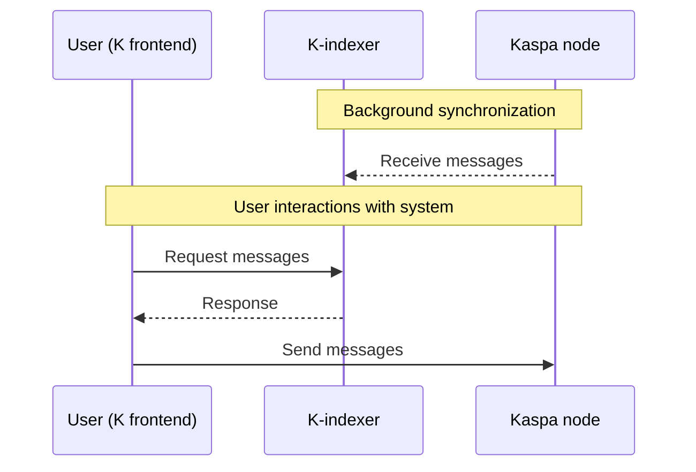

# K - Your voice. Your ideas. Uncensored.

<p align="center">
  
</p>

K is a decentralized microblogging platform that leverages Kaspa's unique features to provide a truly censorship-resistant social experience.

---

## 🚨 The Problem

In today's digital landscape, centralized social media platforms have unprecedented control over information flow and public discourse:

- **Algorithmic Manipulation**: Algorithms arbitrarily boost or suppress user content based on opaque criteria
- **Censorship**: Posts and accounts are removed or shadowbanned for expressing certain viewpoints
- **Account Deletion**: Users lose their entire digital presence overnight without warning or recourse
- **Permissioned Systems**: Your ability to participate depends on the platform's approval
- **Information Control**: A handful of private entities decide what billions of people can see and say

---

## 💡 The Solution

**K** tackles these fundamental issues by leveraging Kaspa's revolutionary technology to create a truly decentralized social media experience:

### 🔑 Key Features

- **✅ Complete Censorship Resistance**: No central authority can delete or suppress your content
- **✅ True Decentralization**: Runs on Kaspa's widely distributed global network
- **✅ Lightning Fast**: Powered by Kaspa's unique speed and GHOSTDAG technology
- **✅ Ultra-Low Cost**: Post ~100 characters for only ~0.00002 KAS (2000 sompis)
- **✅ Maximum Transparency**: All content and interactions are publicly visible on the blockchain
- **✅ Proven Security**: Protected by Kaspa's Proof-of-Work and robust consensus mechanism
- **✅ Based on a sustainable network**: Kaspa's incentive structure ensures network sustainability
- **✅ Maximum uptime**: Kaspa network never stops
- **✅ Open Source**: Community-driven development and participation

### 🌍 Freedom Without Borders

K represents true freedom of expression - **no borders, no control, no censorship**. With the ability to post up to 50,000 messages for just 1 KAS, cost is never a barrier to sharing your thoughts with the world.

Born from the Kaspa community, K is designed to evolve through collaboration with developers, enthusiasts and users who believe in freedom.

---

## ⚠️ Important

**This code is a PROOF OF CONCEPT** designed to demonstrate K's potential to the Kaspa community and showcase a real solution to genuine problems faced by users worldwide.

While K has the potential to become a feature-rich, widely-adopted platform, the current version is experimental and includes:
- 🐛 Bugs and unexpected behaviors
- ⚡ Inefficient processes in some areas  
- 🎨 User interface/experience improvements needed
- 🔧 Missing features and functionality

**By using K, you accept these limitations as part of the development process.**

**🚨 TESTNET ONLY: We strongly recommend using K exclusively on Kaspa testnet until further development.**

---

## 📋 Main Features

### ✅ Available Features
- ✅ **Creating your K identity**: Generate your unique blockchain-based identity
- ✅ **User presentations**: Introduce yourself to the K community
- ✅ **Creating posts**: Share your thoughts with the network
- ✅ **Replying to posts**: Engage in conversations
- ✅ **Viewing network posts**: Browse all content shared by users
- ✅ **Reply notifications**: See all replies involving you
- ✅ **Indexer configuration**: Use local or public indexers for network data
- ✅ **Node configuration**: Connect to local or public Kaspa nodes

### ❌ Future Features (not yet available)  
- ❌ **UI Themes**: Dark theme
- ❌ **Upvoting/Downvoting**: Community-driven content ranking
- ❌ **Reposting**: Share others' content with your network
- ❌ **Quoting**: Add commentary when sharing posts
- ❌ **User mentions**: Tag other users in your posts
- ❌ **Following/Unfollowing**: Curate your content feed
- ❌ **User blocking**: Spam protection and content filtering
- ❌ **User endorsements**: Promote and suggest other users
- ❌ **Historical data**: Access past user activity (indexer dependent)

---

## Software Architecture

K consists of three main components working together to provide a decentralized social media experience.

### 🏗️ Main Architecture Rule
Each user locally runs their own:
- **Kaspa node**: Connects to the Kaspa network and manages transactions
- **K-indexer**: Processes and indexes K protocol transactions
- **Webapp (frontend)**: User interface for interacting with the platform

### 📊 Diagram



---

## 🔗 Related Repositories

This repository contains the **K webapp frontend**. The K-indexer component is available separately:

**K-indexer Repository**: https://github.com/thesheepcat/K-indexer/blob/master/README.md

---

## 📚 Technical Documentation

For detailed technical information, please refer to these comprehensive documents:

**[PROTOCOL SPECIFICATIONS](./PROTOCOL_SPECIFICATIONS.md)**: Complete technical specification of the K protocol, including transaction formats, data structures, and network communication standards.

**[API TECHNICAL SPECIFICATIONS](./API_TECHNICAL_SPECIFICATIONS.md)**: Detailed API documentation covering all endpoints, request/response formats, and integration guidelines for developers about the communication between K-indexer and K.

---

## 🚀 Getting Started

### Prerequisites
Before running K webapp, you need:
1. **Kaspa node** running on testnet
2. **K-indexer** processing transactions
3. **NodeJS** installed on your PC (latest version: https://nodejs.org/en/download)

### 📋 Setup Instructions

#### 1. **Setup Kaspa Node & K-indexer**
Follow the complete setup guide here: https://github.com/thesheepcat/K-indexer/blob/master/README.md

⚠️ Remember: K-indexer will start indexing and storing transactions from the moment of its activation; previously created posts and replies will not be available.

#### 2. **Clone & Install K Webapp**
```bash
# Clone this repository
git clone https://github.com/thesheepcat/K.git
cd K

# Download Kaspa WASM SDK from official repository
# Extract only the "web" folder and place it in:
# /src/kaspa-wasm32-sdk/

# Install dependencies
npm install

# Start development server
npm run dev
```

The webapp will be available at: **http://localhost:5173**

---

## 🎯 Using K

### 🔑 Create Your Identity
1. Open your browser to **http://localhost:5173**
2. Generate a new **Private/Public key pair**
3. Set a **secure password** for your K identity
4. Your unique K identity is now created!

### ⚙️ Configure Your Setup
1. Navigate to **"Settings"** section
2. Configure your **Kaspa node** connection
3. Configure your **K-indexer** connection (use this format http://localhost:3000 or http://your-server:3000)
4. Save your configuration

### 💰 Fund Your Address
1. Go to **"Profile"** section to find your Kaspa address
2. Send multiple small transactions (**1 tKAS each**) to your address
3. **💡 Pro tip**: More UTXOs = faster posting capabilities
4. Use **testnet KAS (tKAS)** only

### 🎨 Start Using K
1. **"User" section**: Create your introduction post to present yourself to the network
2. **"My posts" section**: Share your thoughts and ideas
3. **"Watching" section**: Discover and engage with other users' content
4. Explore and connect with the K community!

---

## 💬 Support & Community

Need help or want to connect with other K users and developers?

**Join the Kluster Discord server**: https://discord.gg/vuKyjtRGKB

---