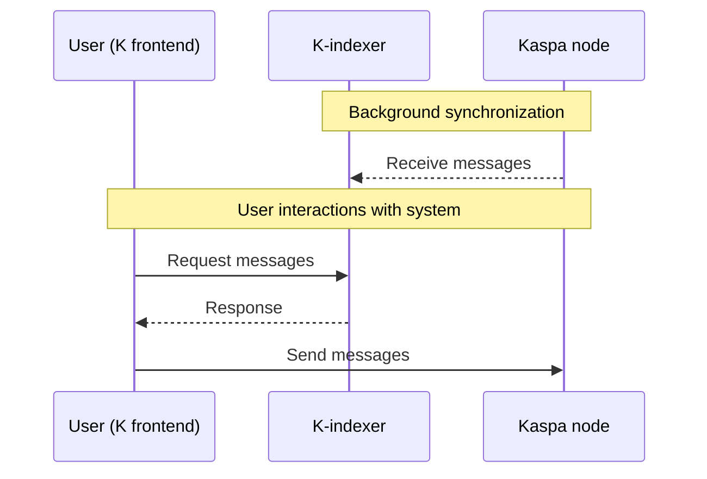

# K - Your voice. Your ideas. Uncensored.

<p align="center">
  
</p>

K is a decentralized microblogging platform that leverages Kaspa's unique features to provide a truly censorship-resistant social experience.

---

## 🚨 The Problem

In today's digital landscape, centralized social media platforms have unprecedented control over information flow and public discourse:

- **Algorithmic Manipulation**: Algorithms arbitrarily boost or suppress user content based on opaque criteria
- **Censorship**: Posts and accounts are removed or shadowbanned for expressing certain viewpoints
- **Account Deletion**: Users lose their entire digital presence overnight without warning or recourse
- **Permissioned Systems**: Your ability to participate depends on the platform's approval
- **Information Control**: A handful of private entities decide what billions of people can see and say

---

## 💡 The Solution

**K** tackles these fundamental issues by leveraging Kaspa's revolutionary technology to create a truly decentralized social media experience:

### 🔑 Key Features

- **✅ Complete Censorship Resistance**: No central authority can delete or suppress your content
- **✅ True Decentralization**: Runs on Kaspa's widely distributed global network
- **✅ Lightning Fast**: Powered by Kaspa's unique speed and GHOSTDAG technology
- **✅ Ultra-Low Cost**: Post ~100 characters for only ~0.00002 KAS (2000 sompis)
- **✅ Maximum Transparency**: All content and interactions are publicly visible on the blockchain
- **✅ Proven Security**: Protected by Kaspa's Proof-of-Work and robust consensus mechanism
- **✅ Based on a sustainable network**: Kaspa's incentive structure ensures network sustainability
- **✅ Maximum uptime**: Kaspa network never stops
- **✅ Open Source**: Community-driven development and participation

### 🌍 Freedom Without Borders

K represents true freedom of expression - **no borders, no control, no censorship**. With the ability to post up to 50,000 messages for just 1 KAS, cost is never a barrier to sharing your thoughts with the world.

Born from the Kaspa community, K is designed to evolve through collaboration with developers, enthusiasts and users who believe in freedom.

---

## 📋 Main Features

### ✅ Available Features
- ✅ **Creating your K identity**: Generate your unique blockchain-based identity
- ✅ **User presentations**: Introduce yourself to the K community
- ✅ **Creating posts**: Share your thoughts with the network
- ✅ **Replying to posts**: Engage in conversations
- ✅ **Viewing network posts**: Browse all content shared by users
- ✅ **Reply notifications**: See all replies involving you
- ✅ **User mentions**: Tag other users in your posts
- ✅ **Upvoting/Downvoting**: Community-driven content ranking
- ✅ **Quoting**: Add commentary when sharing posts
- ✅ **Indexer configuration**: Use local or public indexers for network data
- ✅ **Node configuration**: Connect to local or public Kaspa nodes
- ✅ **UI Themes**: Dark theme
- ✅ **User blocking**: Spam protection and content filtering
- ✅ **User notifications**: User is notified when mentioned
- ✅ **Following/Unfollowing**: Manage your content feed
- ✅ **Desktop app**: K available on desktop environment, without using the K site (on Linux and Windows)
- ✅ **Mobile app**: K available on smartphone environment, without using the K site (on Android)
- ✅ **Personal indexer**: A light and clean indexer for personal use

### ❌ Future Features (not yet available)  
- ❌ **User endorsements**: Promote and suggest other users

---

## Software Architecture

K consists of three main components working together to provide a decentralized social media experience.

### 🏗️ Main Architecture Rule
Each user locally runs their own:
- **Kaspa node**: Connects to the Kaspa network and manages transactions
- **K-indexer**: Processes and indexes K protocol transactions
- **Webapp (frontend)**: User interface for interacting with the platform

### 📊 Diagram



---

## 🔗 Related Repositories

This repository contains the **K webapp frontend**. The K-indexer component is available separately:

**K-indexer Repository**: https://github.com/thesheepcat/K-indexer/blob/master/README.md

---

## 📚 Technical Documentation

For detailed technical information, please refer to these comprehensive documents:

**[PROTOCOL SPECIFICATIONS](./PROTOCOL_SPECIFICATIONS.md)**: Complete technical specification of the K protocol, including transaction formats, data structures, and network communication standards.

**[API TECHNICAL SPECIFICATIONS](./API_TECHNICAL_SPECIFICATIONS.md)**: Detailed API documentation covering all endpoints, request/response formats, and integration guidelines for developers about the communication between K-indexer and K.

---

## 🎯 Using K

K can be used in two ways: **Hosted** (using the community-hosted version) or **Self-Hosted** (running your own infrastructure).

---

### ☁️ **Option 1: Community-Hosted** (Use community-hosted infrastructure)

#### 🌐 Access K
- **Web**: https://k-social.network
- **Desktop app**: Linux/Windows application ([Download](https://github.com/thesheepcat/K/releases))
- **Mobile app**: Android application ([Download](https://github.com/thesheepcat/K/releases))

#### 🔑 Create Your Identity
1. Generate a new **Private/Public key pair**
2. Set a **secure password** for your K identity
3. Your unique K identity is now created!

#### 💰 Fund Your Address
1. Go to **"Profile"** section to find your Kaspa address
2. Send multiple small transactions (**few KAS each**) to your address

**💡 Pro tip**: More UTXOs = faster posting capabilities

#### 🎨 Start Using K
1. **"User" section**: Create your introduction post to present yourself to the network
2. **"My posts" section**: Share your thoughts and ideas
3. **"Watching" section**: Discover and engage with other users' content
4. Explore and connect with the K community!

**📹 Watch the video tutorial to start using K!**

https://github.com/user-attachments/assets/4d12e986-fc37-4aa6-86a4-da476fe5760c

---

### 🏠 **Option 2: Self-Hosted** (You run K + K-indexer)

#### 🔑 Create Your Identity
1. Open your browser to **http://localhost:5173**
2. Generate a new **Private/Public key pair**
3. Set a **secure password** for your K identity
4. Your unique K identity is now created!

#### ⚙️ Configure Your Setup
1. Navigate to **"Settings"** section
2. Configure your **Kaspa node** connection
3. Configure your **K-indexer** connection (use this format http://localhost:3000 or http://your-server:3000)
4. Save your configuration

#### 💰 Fund Your Address
1. Go to **"Profile"** section to find your Kaspa address
2. Send multiple small transactions (**few KAS each**) to your address

**💡 Pro tip**: More UTXOs = faster posting capabilities

#### 🎨 Start Using K
1. **"User" section**: Create your introduction post to present yourself to the network
2. **"My posts" section**: Share your thoughts and ideas
3. **"Watching" section**: Discover and engage with other users' content
4. Explore and connect with the K community!

---

## 🚀 Getting Started with Self-Hosted (K + K-indexer)

### Prerequisites
Before running K webapp, you need:
1. **Kaspa node** running on mainnet
2. **K-indexer** processing transactions
3. **NodeJS** installed on your PC (latest version: https://nodejs.org/en/download)

### 📋 Setup Instructions

#### 1. **Setup Kaspa Node & K-indexer**
Follow the complete setup guide here: https://github.com/thesheepcat/K-indexer/blob/master/README.md

⚠️ Remember: K-indexer will start indexing and storing transactions from the moment of its activation; previously created posts and replies will not be available.

#### 2. **Clone & Install K Webapp**
```bash
# Clone this repository
git clone https://github.com/thesheepcat/K.git
cd K

# Install dependencies
npm install

# Start development server
npm run dev
```

The webapp will be available at: **http://localhost:5173**

#### 3. **Build Standalone Desktop Application (Optional)**

You can compile K as a standalone desktop application using Electron:

```bash
# Install dependencies (if not already done)
npm install

# Build for Linux (deb package)
npm run electron:build:deb

# Build for Linux (AppImage)
npm run electron:build:appimage

# Build for Windows
npm run electron:build:win
```

The compiled applications will be available in the `build/` directory.

#### 4. **Build Standalone Mobile Application for Android (Optional)**

You can compile K as a standalone mobile application for Android using Capacitor:

**Prerequisites:**
- **Android Studio** installed on your system
- **Java Development Kit (JDK) 21** or higher
- **Android SDK** (usually installed with Android Studio)
- **Gradle** (usually included with Android Studio)

**Build Steps:**
```bash
# Install dependencies (if not already done)
npm install

# Build the Android application
npm run build:android
```

The build process will generate an APK file that can be found in:
`android/app/build/outputs/apk/debug/app-debug.apk`

**⚠️ Important Notes:**
- **This build generates a DEBUG version** of the application, which is intended for development and testing purposes only.
- **The APK is UNSIGNED**, meaning it won't be suitable for distribution through official app stores.
- For production releases, you'll need to create a signed release build using proper keystore credentials.
- The debug APK can be installed directly on Android devices for testing by enabling "Install from unknown sources" in device settings.

---
## ❓ Frequently Asked Questions
1. **"How are the user contents (posts, replies, etc) being stored? In the Kaspa node?**: All K relevant data are included in regular Kaspa transactions (in the payload) and processed by Kaspa node; K-indexer is connected to Kaspa node, it receives all transactions and it filters only K relevant transactions; then, K-indexer saves all these data in a dedicated database. 
2. **"How are you planning on enabling historical data?**: If historial data have already been saved in K-indexer, they are available to the user; if historical data traversed Kaspa network before K-indexer was acttivated, they aren't available. We're exploring the possibility to use kaspa.org APIs to retrieve hostorical data for specific transactions requested by the user, as a fallback mechanism. For the moment, we don't have a way to sync new K-indexers with existing K-indexers.
3. **"Will the K stored data increase the storage requirements for running a Kaspa node?**: Kaspa node requirements aren't affected by K or K-indexer as Kaspa node is just doing regular "Kaspa node things"; by the way, if the machine (PC, server, VPS, VM, etc) is hosting both Kaspa node and K-indexer, more storage space will be required (because of K-indexer database).
4. **"How do you delete data? How do you prevent illegal content?**: Kaspa is an immutable decentralized ledger; it means that transactions (and their content) can't be deleted by anyone (except by the regular pruning process executed by the node itself). The so called "Illegal contents" are part of the decentralized and censorship resistant nature of K: they are a natural expression of the real "freedom of speech". Anyhow, as we understand this can be a tricky point for some users, we introduced some mitigations:
- Allowing the user to block contents from some other users, just by using a "Block user" feature on K webapp; in this way, the user will not see any more content from the user being blocked;
- Allowing the user to run a recursive clean-up of its own K-indexer, in order to remove unwanted contents; this aspect is extensively covered in the K-indexer documentation.
1. **"On login page, the user is required to generate or insert a Kaspa private key. Is it safe to insert and keep user's private key in K?**: As general rule, we suggest to create a dedicated K identity and private key on the first use on K, avoiding to insert any existing private key which could be already linked to user funds; once the private and public key are generated, the user can fund small amount of KAS (ie. 4/5 KAS) to the K address, in order to pay for network fees. In addition, here i share a dedicated document which aims to explain to both tech and non-tech people how authentication works in K, how private keys are managed, handled, saved, exposed, etc: [AUTHENTICATION MANAGEMENT](./AUTHENTICATION_MANAGEMENT.md).

---

## ⚠️ Important

**This code is a PROOF OF CONCEPT** designed to demonstrate K's potential to the Kaspa community and showcase a real solution to genuine problems faced by users worldwide.

While K has the potential to become a feature-rich, widely-adopted platform, the current version is experimental and includes:
- 🐛 Bugs and unexpected behaviors
- 🐌 Inefficient processes in some areas
- 🎨 User interface/experience improvements needed
- 🔧 Missing features and functionality

**By using K, you accept these limitations as part of the development process.**

---

## 💬 Support & Community

Need help or want to connect with other K users and developers?

**Join the Kluster Discord server**: https://discord.gg/vuKyjtRGKB

---
